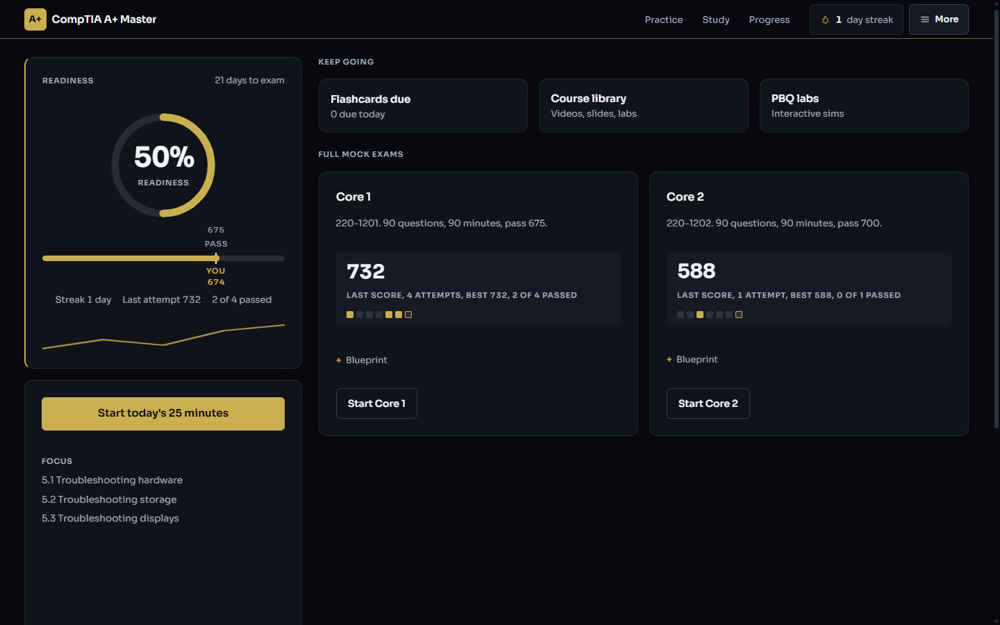
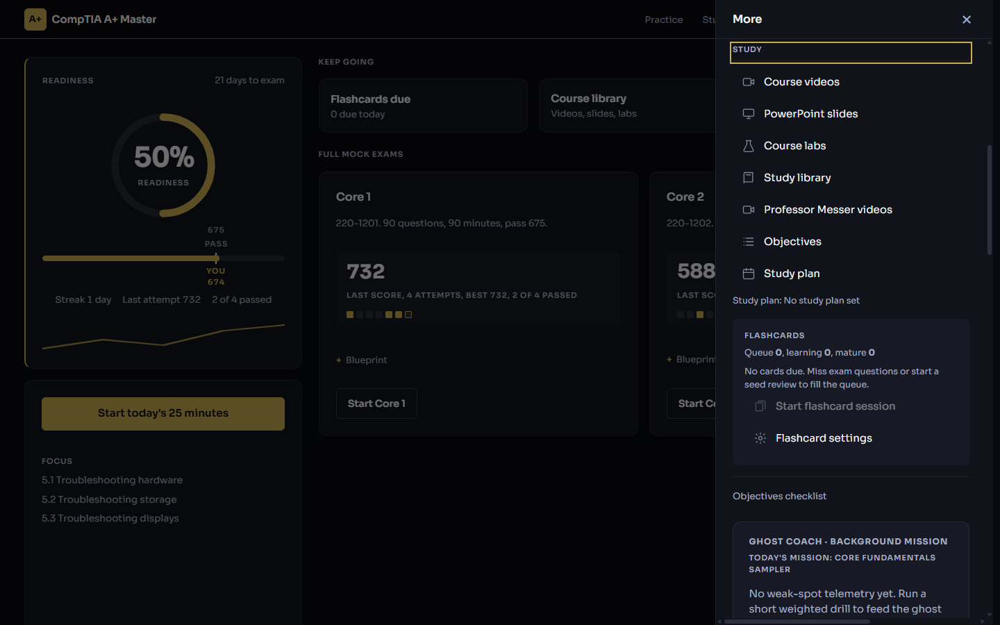
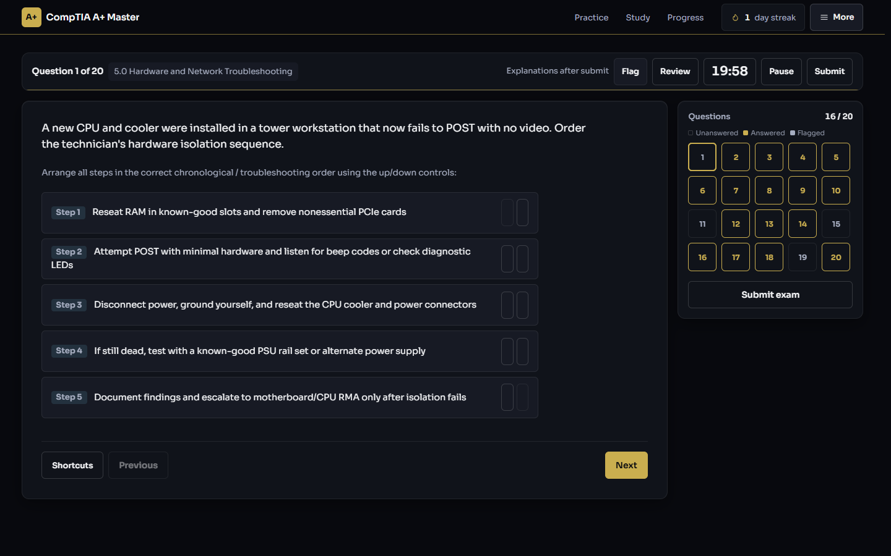
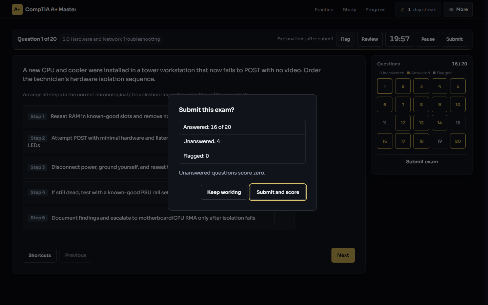
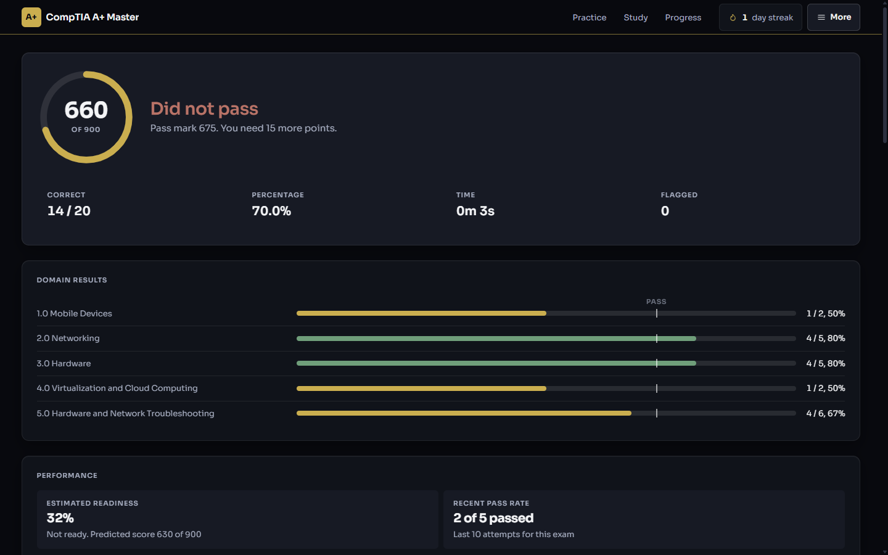
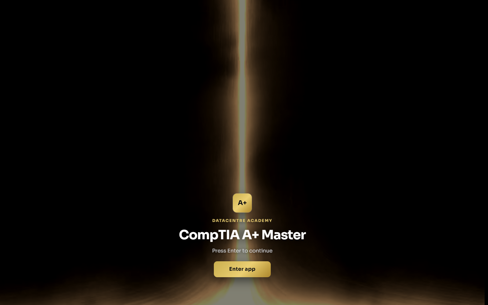

# CompTIA A+ Master

An offline-first exam simulator and study suite for the CompTIA A+ Core 1 (220-1201) and Core 2 (220-1202) certifications. It ships as a progressive web app, a Windows and macOS desktop app built on Electron, and a terminal exam runner in Python.

Built by Datacentre Academy for technicians training for datacentre and enterprise IT support roles. Licensed under the GNU Affero General Public License v3.0.

[](https://github.com/LuminaraDigital/comptia-a-plus-master/actions/workflows/ci.yml)
[](LICENSE)
[](CHANGELOG.md)

## Screenshots

Captured from the Windows desktop build at 1440 by 900 with `node tools/capture_screenshots.js`.

| Home | Study drawer |
| --- | --- |
|  |  |

| Exam runner | Submit dialog |
| --- | --- |
|  |  |

| Results | Startup |
| --- | --- |
|  |  |

## What it does

**Exam engine that mirrors the real test**

- 90 questions in 90 minutes, sampled to the official domain weightings for each exam
- Scaled scoring from 100 to 900 with the real pass marks (675 for Core 1, 700 for Core 2)
- Single answer, multiple answer, matching, ordering and performance-based question types
- Flag for review, distractor strike-through, question matrix, pause and resume
- Domain drills, missed-question drills and an adaptive practice loop that targets weak objectives

**Study tools**

- A study library built from the objectives, the academy's own notes and open course material
- Spaced repetition memory mode for facts, ports and command syntax
- Objective tracker and readiness score against every sub-objective in both blueprints
- A Professor Messer video index mapped to each objective
- Ghost Coach, an optional AI tutor that explains a question when you ask (bring your own Groq key)

**Proof of mastery**

- A hash-chained local ledger records every session so progress cannot be edited after the fact
- Exportable evidence of outcomes for instructors and employers

**Runs anywhere**

- Installable PWA with a service worker for full offline use
- Electron desktop builds for Windows (installer and portable) and macOS
- Optional cloud sync through Supabase, off by default
- Cloudflare Workers static deployment for the web edition

## Quick start

Web edition, no install:

```bash
npx serve .
```

Then open the printed URL. The app entry point is `index.html`.

Desktop edition:

```bash
npm install
npm start
```

Terminal edition:

```bash
python practice_exam.py
```

## Repository layout

| Path | Purpose |
| --- | --- |
| `index.html`, `js/`, `css/` | The web application shell, engine modules and the black and gold theme |
| `main.js`, `preload.js` | Electron main process and the sandboxed preload bridge |
| `exam_data.json` | The compiled question bank (generated, do not edit by hand) |
| `study_library.json` | The compiled study library (generated) |
| `objectives_data.json` | Canonical objective map for both exams |
| `tools/` | Build, validation, release, test and deploy scripts |
| `_bank/shards/` | Source shards that the bank builder merges into `exam_data.json` |
| `CompTIA_A_Plus_Mastery/`, `notes/` | The academy's study notes in Markdown |
| `docs/` | Release, deployment, monetisation and sync guides |
| `supabase/` | Schema for the optional sync backend |

Open course material from Packt Publishing is pulled in as git submodules. Run this after cloning if you want to rebuild the exam bank or study library from source:

```bash
git submodule update --init --recursive
```

## Building the content

The question bank and study library are generated. Edit the shards or the notes, then rebuild:

```bash
python tools/build_bank.py
python tools/validate_bank.py --bank exam_data.json
python build_study_library.py
```

The validator enforces the schema in [BUILD_SPEC.md](BUILD_SPEC.md): exact domain strings, objective codes that exist in the blueprint, distractor analysis for every wrong option and a video reference per objective where one exists.

The curriculum viewer reads `curriculum_data.js`, which is generated from local lab documents, slide decks and videos. Those source files are not redistributable and are not in this repository, so the viewer shows a rebuild notice until you run `python tools/build_curriculum.py` against your own copies.

## Testing

```bash
npm run check
npm test
python tools/validate_bank.py --bank exam_data.json
```

`npm test` runs every self-contained script in `tools/test_*.js` and `tools/verify_*.js`. CI runs the same three commands and also refuses any commit that tracks secrets, certificates or third-party media.

`python tools/release_gate.py` runs all of the above plus the typography, version and packaging checks that must pass before a build ships. `node tools/capture_screenshots.js` refreshes the README screenshots from the packaged desktop app.

## Releasing

Follow [docs/RELEASE_CHECKLIST.md](docs/RELEASE_CHECKLIST.md). The version lives in one place, `release.config.json`, and the installer scripts write it into `package.json`.

| Target | Command | Guide |
| --- | --- | --- |
| Windows | `npm run package-win` | [docs/WINDOWS_RELEASE.md](docs/WINDOWS_RELEASE.md) |
| macOS | `npm run package-mac` | [docs/MACOS_RELEASE.md](docs/MACOS_RELEASE.md) |
| Web | `python tools/deploy_cloudflare.py` | [docs/CLOUDFLARE_FREE_DEPLOYMENT_GUIDE.md](docs/CLOUDFLARE_FREE_DEPLOYMENT_GUIDE.md) |

Code signing reads its password from the `CSC_KEY_PASSWORD` environment variable. Cloudflare and R2 credentials go in `.env`, copied from `.env.example`. Nothing secret is ever committed.

## Configuration

| File | What it controls |
| --- | --- |
| `js/entitlements-config.js` | Free tier limits and the paid tier switch. Disabled by default so every feature is open. |
| `js/groq-config.js` | Ghost Coach model and endpoint. The API key is supplied at runtime, never stored in the repo. |
| `js/sync-config.js` | Supabase project URL and anon key for optional cloud sync. |
| `js/telemetry-config.js` | Opt-in usage telemetry. See [docs/ANALYTICS.md](docs/ANALYTICS.md). |
| `js/media-config.js` | Where the desktop app downloads the optional course video pack from. |

## Contributing

Read [CONTRIBUTING.md](CONTRIBUTING.md) before opening a pull request. The short version: keep the style plain, no em dashes or emoji, run the tests, and never commit media you do not have the right to redistribute.

Security issues go through [SECURITY.md](SECURITY.md), not the public issue tracker.

## License

Copyright (c) 2026 Datacentre Academy and contributors.

This program is free software: you can redistribute it and/or modify it under the terms of the GNU Affero General Public License as published by the Free Software Foundation, either version 3 of the License, or (at your option) any later version. See [LICENSE](LICENSE) for the full text.

If you run a modified version of this software as a network service, the AGPL requires you to offer the corresponding source to its users.

Third-party content and its licensing is listed in [THIRD_PARTY_NOTICES.md](THIRD_PARTY_NOTICES.md). CompTIA and A+ are registered trademarks of CompTIA, Inc. This project is not affiliated with or endorsed by CompTIA.
