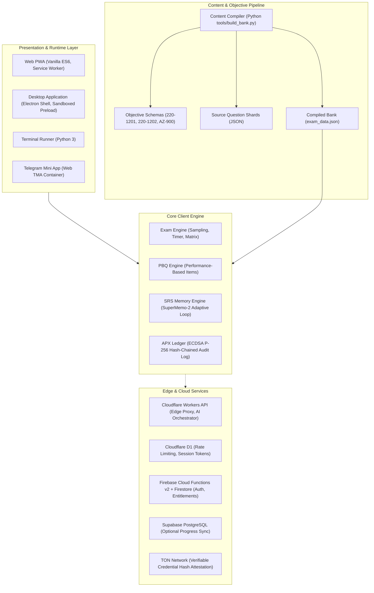

# Clariora Architecture Specification

## 1. System Overview

Clariora is an offline-first examination simulator and mastery suite designed for technical certification candidates (CompTIA A+ 220-1201/1202 and Microsoft Azure AZ-900). The architecture prioritizes client-side determinism, tamper-evident outcome tracking, and multi-surface distribution across web, desktop, and terminal environments.



---

## 2. Runtime Boundaries & Surfaces

### 2.1 Progressive Web App (PWA)
- **Engine:** Vanilla ECMAScript 2022 without heavy runtime framework overhead, maximizing battery efficiency and load performance.
- **Service Worker (`sw.js`):** Implements a cache-first network-fallback strategy across all core application shell assets, CSS design tokens, and question banks. Operates fully disconnected from the internet.
- **State Storage:** `localStorage` and `IndexedDB` for high-throughput learner telemetry and cryptographically signed session blocks.

### 2.2 Desktop Application (Electron)
- **Process Isolation:** The main process (`main.js`) maintains strict security boundaries: `contextIsolation: true`, `nodeIntegration: false`, and `sandbox: true`.
- **Preload Bridge (`preload.js`):** Exposes a typed, zero-leak API via `contextBridge.exposeInMainWorld`, allowing file-system access for diagnostic export, local SQLite caching, and enterprise kiosk anti-dismissal locks during active timed exams.
- **Enterprise Distribution:** Packaged via NSIS with support for silent enterprise deployment switches (`/S`, `/ALLUSERS=1`) for Microsoft Intune, SCCM, and Active Directory GPO.

### 2.3 Terminal Runner
- **Engine:** Pure Python 3 CLI runner (`practice_exam.py`) designed for headless server environments, low-spec remote terminals, and datacenter jump-boxes.

### 2.4 Telegram Mini App (TMA)
- **Container:** Runs inside the Telegram in-app browser wrapper with responsive touch-first layout overrides (`css/tma-overrides.css`), native haptic feedback, and optional Telegram Stars billing verification.

---

## 3. Data Integrity & Cryptographic Ledger (APX)

To provide verifiable proof of study for instructors, enterprises, and certification candidates, Clariora includes the APX ledger (`ledger_engine.js`):

1. **Identity Generation:** Upon initial launch, the client generates an ECDSA keypair using the Web Cryptography API (`P-256` curve with `SHA-256`). The private key is persisted securely in local IndexedDB and never exported or transmitted.
2. **Block Structure:** Each completed practice exam, drill, or domain mastery session is formatted as a structured block:
   ```json
   {
     "index": 42,
     "timestamp": 1727221200000,
     "prevHash": "e3b0c44298fc1c149afbf4c8996fb92427ae41e4649b934ca495991b7852b855",
     "action": "EXAM_COMPLETE",
     "payload": {
       "exam": "core1",
       "score": 820,
       "correct": 74,
       "total": 90,
       "durationSeconds": 4820
     },
     "publicKey": "04a1b2...",
     "signature": "3045022100..."
   }
   ```
3. **Chain Verification:** The client independently traverses the blockchain on boot, verifying SHA-256 link continuity and ECDSA signature validity. If local data tampering is detected, the compromised block is quarantined and flagged in the UI.

---

## 4. Security Architecture & Zero-Trust Rules

### 4.1 Edge Security (Cloudflare Workers)
- **Worker Isolation:** The edge API (`workers/api_worker.js`) routes requests through an in-memory circuit breaker and token budget system.
- **Rate Limiting:** Sliding-window rate limiting backed by Cloudflare D1 and KV.
- **Provider Scrubbing:** Outbound AI queries scrub private identifiers, student keys, and proprietary question IDs before dispatching prompts to model providers.

### 4.2 Database Security (Cloud Firestore)
- **Deny-by-Default:** Configured in `firestore.rules` where root documents and subcollections require explicit authenticated token ownership (`isOwner(userId)`).
- **Server Timestamp Anchoring:** Client updates must send `request.time` for timestamps to prevent backdating or replay attacks against rate limiters.
- **Attribute Locking:** Critical security claims (`role`, `isAdmin`, `is_verified`, `tier`) cannot be mutated by client-side document updates.

---

## 5. Content Pipeline & Quality Engineering

```
shards/*.json  ──>  tools/build_bank.py  ──>  exam_data.json  ──>  tools/validate_bank.py
```

- **Shard Authoring:** Question banks are organized into domain-specific shards (`shards/core1_*.json`, `shards/core2_*.json`).
- **Validation Engine:** `tools/validate_bank.py` enforces strict structural and pedagogical constraints:
  - Exact domain naming matching official CompTIA/Microsoft blueprints.
  - Sub-objective codes mapped directly to the official syllabus.
  - Mandatory distractor analysis justifying why incorrect options are invalid.
  - Direct video and study reference linkage for remediation.
- **Release Gating:** Every release candidate must pass all 10 automated stages of `tools/release_gate.py`:
  1. Node syntax check across all scripts
  2. Complete execution of all automated test suites
  3. Question bank schema and blueprint conformance
  4. Credential and secret leak scanning
  5. Dependency audit for critical vulnerabilities
  6. Typography and character set hygiene
  7. Onboarding and security gate keys
  8. Packaging exclusion rules
  9. Version consistency across all manifests
  10. Asset distribution size limits (< 25 MB)
