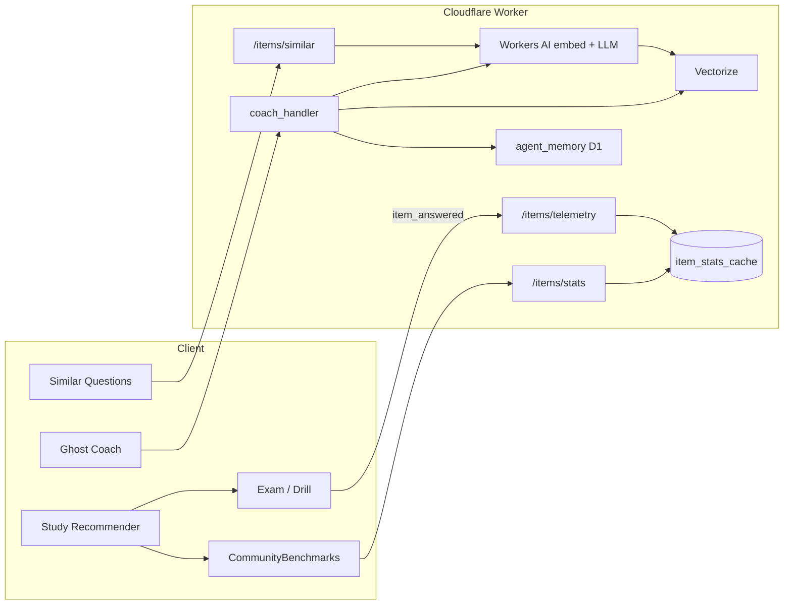

# Big Data for Clariora: implementation plan

Status date: 2026-09-25.  
**Status: Implement-now sequence SHIPPED to production** (`clariora.com.au`, Worker version 914de7b4-145b-4327-8ebf-6d0242ba804e).  
Scope: turn modest learner + bank data into a 10x better product for Ghost Coach and for learners, without breaking offline-first or the existing Cloudflare edge stack.

Assumption: we stay on the current stack (vanilla JS client, Cloudflare Workers + D1 + Workers AI, optional Supabase sync). We do **not** vendor LangChain, LlamaIndex, Chroma, CrewAI, or on-device Hugging Face runtimes into the learner app. That decision is already recorded in `docs/AGENT_WORKFLOW_IMPLEMENTATION_PLAN.md` and still holds.

---

## 1. What the app already has (do not rebuild)

| Capability | Where it lives | Gap |
| --- | --- | --- |
| Exam bank (~1,130 items: 636 Core 1, 494 Core 2) | `exam_data.json`, `_bank/shards/` | No vector index; no near-duplicate detector |
| Adaptive weak-area raids | `js/adaptive-loop.js` | Uses misses only; ignores community difficulty |
| Bayesian readiness / objective_stats | `js/readiness2.js` | Strong local model; not yet fed by community item parameters |
| Anonymous item telemetry ingest | `js/telemetry.js` → `POST /api/v1/items/telemetry` → `workers/item_stats.js` | Pipeline exists; UI still falls back to synthetic benchmarks |
| Item stats cache (p-value, distractor spread, miskey flag) | D1 `item_stats_cache` | `point_biserial` is still a stub (~0.35), not computed |
| Report-a-problem loop | `js/report-problem-modal.js` → `/api/v1/items/report` | Working path; ops review queue is thin |
| Community benchmark UI | `js/community-benchmarks.js` | Mostly hash/difficulty **placeholder** when cache miss |
| Ghost Coach + specialist packs | `workers/coach_orchestrator.js`, `coach_handler.js` | Memory exists; no RAG over bank / notes |
| Learner memories (D1) | `workers/agent_memory.js` | Text memories only; no embeddings |
| Workers AI binding | `wrangler.toml` `[ai]`, `@cf/meta/llama-3.1-8b-instruct` | Embeddings / Vectorize not wired yet |

**Bottom line:** the "big data" plumbing for item analytics is ~70% shipped. The highest-ROI work is closing that loop and adding edge embeddings, not standing up a new quiz framework or Python ML stack in the client.

---

## 2. Honest pushback on the research brief

1. **Forking Moodle / Open edX / random MIT quiz apps** adds little. Clariora already has sampling, PBQs, ledger, readiness, and an edge coach. Study their data models if useful; do not adopt their runtimes.
2. **Hosting TinyLlama / Phi-3 / Qwen in Electron for every learner** fights the product: budgets, paywall, and offline coach already route through the Worker. Prefer Workers AI + existing providers.
3. **Fine-tuning on Stack Overflow / generic "exam questions" datasets** is weak for CompTIA pedagogy and is a copyright foot-gun if any dump contains vendor content. Use those only as **style references for admin tooling**, never as bank content.
4. **LangChain / LlamaIndex / Chroma as product deps** duplicate what Workers AI + Vectorize + D1 can do on the edge you already pay for. Keep Python notebooks for offline authoring only.
5. **Synthetic community %** in `community-benchmarks.js` actively misleads learners. Replacing placeholders with live D1 stats is a trust win before any fancy model.

---

## 3. What we can implement right now (next 1-2 weeks)

These need no new vendor accounts beyond Cloudflare (AI binding already present). Ordered by value.

### Now-1. Wire live community stats into the UI (2-3 days)

**Do:**

- On review / post-answer, fetch `GET /api/v1/items/stats?question_id=…` (batch if needed).
- Persist into `community_stats_cache` and render real `p_value`, sample size, distractor trap; hide badge until `sample_size >= 30`.
- Stop showing hash-based fake rates when remote data is absent (show "Not enough community data yet" or omit).

**Files:** `js/community-benchmarks.js`, maybe `js/ui.js` review panel, `tools/test_edge_architecture.js`.

**Done when:** a question with D1 rows shows real %, and a cold question does not invent a %.

### Now-2. Harden item telemetry end-to-end (2 days)

**Do:**

- Confirm `item:answered` fires for drills, adaptive raids, diagnostics, and PBQs (not only full mocks in `js/engine.js`).
- Ensure consent gate + flush to `/api/v1/items/telemetry` matches `docs/ANALYTICS.md`.
- Add a tiny admin/export script: `tools/item_analysis_export.py` reading D1 dump or Worker admin endpoint → `_bank/analysis/item_stats.json`.
- Teach `tools/validate_bank.py` to warn on `flagged_miskey` / extreme p-values when the analysis file is present.

**Done when:** answering in practice mode increases `item_stats_cache.sample_size` for that id; validator can list flags.

### Now-3. Real discrimination (point-biserial) job (2-3 days)

**Do:**

- Nightly (or on-demand admin) Worker/cron: for each question with `n >= 30`, compute point-biserial using a learner ability proxy (e.g. rolling accuracy or last mock scaled score hashed/bucketed; **never store PII**).
- Replace the hardcoded `0.35` write path in `item_stats.js`.
- Flag negative discrimination and p > 0.95 / p < 0.20 for author review.

**Done when:** `point_biserial` in D1 moves with data; flagged list is non-empty only when criteria met.

### Now-4. Edge embeddings + "Similar questions" (4-5 days)

**Stack (fits this repo):**

- Embed with Workers AI `@cf/baai/bge-small-en-v1.5` (384-d, MIT-lineage BGE family; already on Cloudflare catalog) or `@cf/baai/bge-base-en-v1.5` (768-d) if quality wins.
- Store in **Cloudflare Vectorize** (binding next to existing `[ai]`).
- Metadata: `question_id`, `exam`, `domain`, `objective`, `difficulty`.
- Index text: `question + explanation` (not answer keys in public query responses).

**Build path:**

1. `tools/index_question_vectors.py` or a Worker admin job: walk `exam_data.json`, batch embed, upsert Vectorize.
2. Hook into `tools/build_web_dist.py` / release gate so bank changes reindex.
3. API: `GET /api/v1/items/similar?id=` and optional `POST /api/v1/search/semantic` (authenticated / rate-limited).
4. UI: "Practice similar" on review; coach tool `retrieve_similar_items` allowlisted in orchestrator.

**Offline:** ship a small precomputed `similar_neighbors.json` (top-k ids per question) in `dist_web` so desktop/PWA still works without network; refresh on deploy.

**Done when:** review shows 3 similar items with same objective bias; coach can cite them; offline neighbor file is current after bank build.

### Now-5. Coach RAG over bank + notes (3-4 days, after Now-4)

**Do:**

- On coach turn: embed the miss stem / objective → Vectorize top-k → inject **allowlisted** snippets (objective title, short explanation, notes path) into specialist prompt.
- Never send full proprietary bank wholesale to third-party providers when Workers AI can answer; when external LLMs are used, keep existing scrubbing in `coach_security_guard.js`.
- Write a memory of form `weak_objective + last_miss_theme` via `agent_memory.js`.

**Done when:** for the same miss, coach references a related bank item or note without hallucinating an id that is not in the retrieval set.

---

## 4. Phase plan (6-8 weeks)

### Phase A: Trust data (weeks 1-2) = Now-1..Now-3

Closes `docs/ROADMAP_10X.md` item 1.1 for real. Trust > novelty.

**Deliverables:** live benchmarks, real p / discrimination, validator flags, report queue triage note in admin.

### Phase B: Semantic layer (weeks 2-4) = Now-4..Now-5

**Deliverables:** Vectorize index, similar-questions UX, offline neighbor map, coach retrieval tool.

**Out of scope here:** open-web crawling of CompTIA materials; third-party quiz dumps in the bank.

### Phase C: Personalization that feels 10x (weeks 4-6)

Use **local** event streams you already have (history, objective_stats, adaptive plans, memories). Optional light edge scoring; no petabyte cluster.

| Feature | Method | Surface |
| --- | --- | --- |
| Next-topic recommender | Rank objectives by (1 - posterior accuracy) × blueprint weight × recency decay (already in readiness2) | Home + Ghost Coach mission |
| Exam readiness narrative | readiness2 score + confidence band + weakest 3 objectives + days-to-target heuristic | Results / Today |
| Study profile clusters | Rule buckets first: "trap hunter", "fast guesser", "slow accurate", "PBQ weak" from time-on-item + type accuracy | Coach tone + drill mix |
| Adaptive difficulty | Prefer items whose community p-value is near learner ability (IRT-lite); fall back to tagged `difficulty` | Adaptive loop + domain drills |
| Duplicate / near-dup bank hygiene | Cosine > threshold on Vectorize → author queue | `tools/validate_bank.py` |

**Deliverables:** `js/study-recommender.js` (or extend adaptive-loop), coach mission uses recommender, adaptive sampling accepts item_stats when cached.

### Phase D: Authoring acceleration (weeks 6-8, admin-only)

**Do:**

- Offline Python tool (dev machine): Phi-3-mini or Qwen2-1.5B **or** Workers AI Llama for draft stems given an objective + notes excerpt.
- Output only into `_bank/drafts/`; require human review + `validate_bank.py` before shard merge.
- Optional: explain-rewriter that compresses long explanations for mobile.

**Do not:** auto-publish generated items; train on copyrighted CompTIA dumps; expose generator in the learner UI.

---

## 5. Architecture (target)

Offline path: local history + readiness2 + `similar_neighbors.json` + local coach heuristics. Online path upgrades benchmarks, similar search, and coach RAG.

---

## 6. Hugging Face / GitHub map (what we actually use)

| Asset | License note | Role in Clariora |
| --- | --- | --- |
| `@cf/baai/bge-small-en-v1.5` via Workers AI | BGE family (MIT on HF); run through CF | Production embeddings |
| `@cf/baai/bge-base-en-v1.5` | Same | Optional higher quality |
| Phi-3-mini / Qwen2-1.5B | MIT / Apache-2.0 | **Admin draft tool only**, not in learner bundle |
| TinyLlama | Apache-2.0 | Skip for product; CF Llama already covers edge fallback |
| sentence-transformers all-MiniLM | Apache-2.0 | Optional offline index script if CF batch limits bite |
| LlamaIndex / LangChain / Chroma | MIT / Apache | Patterns only; not product deps |
| Moodle / Open edX | GPL / AGPL | Reference analytics schemas only |
| OpenManus-RL / Nemotron / xLAM / SWE-Lego (etc.) | Mixed; some CC-BY-NC | **Local research only** - see `docs/LOCAL_AGENT_TRAINING.md`. Never in `dist_web`. |

Sources checked this session:

- [Cloudflare Vectorize + Workers AI embeddings](https://developers.cloudflare.com/vectorize/get-started/embeddings/)
- [Workers AI embedding models / pricing](https://developers.cloudflare.com/workers-ai/platform/pricing/)
- [bge-base-en-v1.5 on Workers AI](https://developers.cloudflare.com/workers-ai/models/bge-base-en-v1.5/)

---

## 7. Privacy and legal guardrails

- Keep item telemetry as today: question id, option index, correct flag, seconds, exam type. No emails, install ids, or answer text in `item_telemetry`.
- Consent remains required for upload (`telemetry_consent`).
- Vector metadata must not include user ids.
- Generated content is academy-original after human edit; never paste CompTIA exam stems into training sets.
- AGPL product: any shipped server code stays consistent with LICENSE; do not silently pull incompatible SaaS SDKs into the Worker bundle without review.

---

## 8. Success metrics (prove the 10x)

| Metric | Baseline | Target after Phase C |
| --- | --- | --- |
| % of reviewed items showing real community stats (n≥30) | ~0 (placeholders) | >50% of active bank ids with traffic |
| Miskeys found via flags + reports | Ad hoc | ≥1 fixed per release cycle once traffic exists |
| Coach turns that include a verified retrieved item id | 0 | >40% of miss-explanation turns |
| Similar-question click → completed mini-drill | 0 | Track via telemetry `similar_drill_started` |
| Readiness move after following recommender for 7 days | Unknown | Measure vs holdout in telemetry |

If retention rises but accuracy/readiness fall, stop expanding gamification and rebalance (same stance as `docs/L2E_RETENTION_IMPLEMENTATION_PLAN.md`).

---

## 9. Sequencing vs existing roadmaps

| This plan | Existing doc |
| --- | --- |
| Phase A | Completes ROADMAP_10X §1.1 (item analysis) for real |
| Phase B-C | Extends AGENT_WORKFLOW CAR with retrieval; still no full LangChain |
| Phase D | Supports ROADMAP_10X §4.1 bank growth without lowering quality |
| Deferred | ROADMAP exam-day mode, store signing, mastery map UI (still valuable; orthogonal) |

---

## 10. Recommended first build (approve to start)

Ship in this order in one focused push:

1. Live stats UI + kill fake benchmarks  
2. Emit `item:answered` from all practice paths  
3. Vectorize index + similar API + offline neighbor file  
4. Coach retrieval tool  
5. Point-biserial cron + validator warnings  

Estimated calendar time for an experienced repo contributor: **~2 weeks** for items 1-4, **+3 days** for item 5.

---

## 11. Explicit non-goals

- New LMS / quiz-app rewrite  
- Client-side 1B+ parameter models  
- Scraping or ingesting CompTIA copyrighted exams  
- Replacing readiness2 with a black-box cloud model  
- Auto-publishing LLM-generated questions to production shards  
